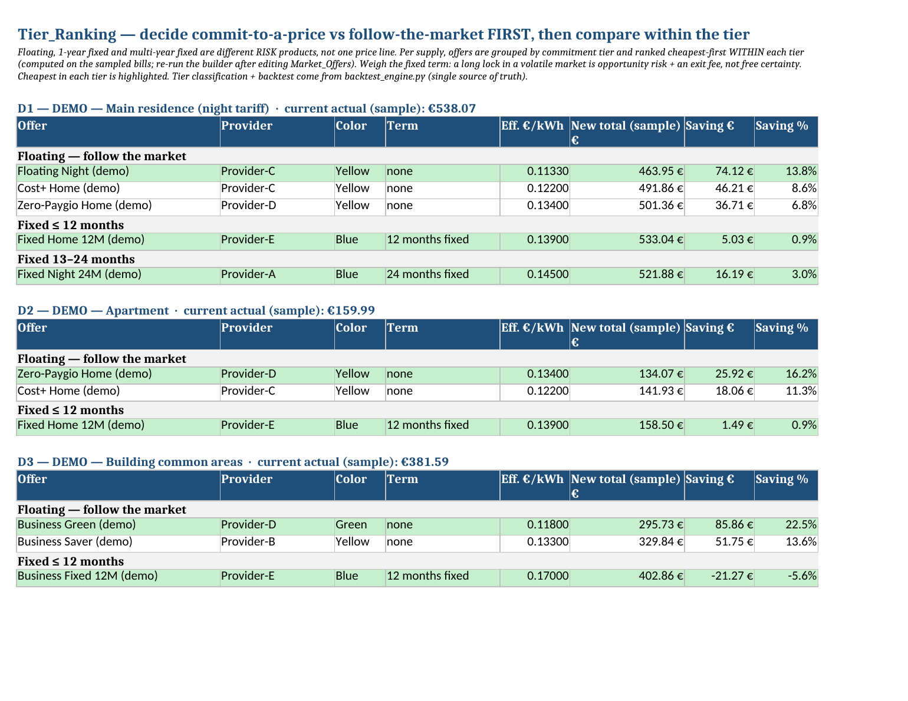
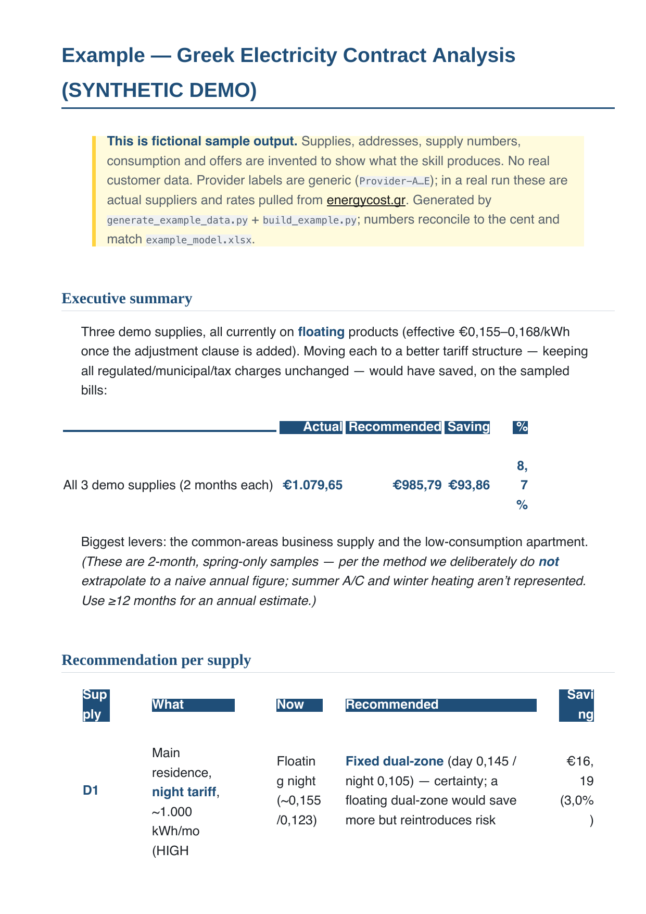

# Greek Electricity Toolkit

[](https://github.com/pmoust/greek-electricity-toolkit/actions/workflows/ci.yml)
&nbsp;
&nbsp;

A Claude skill (plus a worked analysis) for reading Greek electricity bills, working out what you actually pay, and finding whether another provider/tariff would be cheaper — grounded in how Greek bills are really built, not the marketing headline rate.

## Why this exists

I have four electricity supplies — three with ΗΡΩΝ (a residence and two on a building on Kea), one big one with ΔΕΗ (my main home, on a night tariff). I wanted a straight answer to a simple question: **am I overpaying, and what should I switch to?**

I asked power brokers. I got nowhere — vague promises, headline "€0,08/kWh" numbers that don't survive contact with an actual bill, and no like-for-like comparison. So one afternoon, from the beach, I pointed an agent at the PDFs and let it do the work: parse every bill, learn how the charges are calculated, research the market, and backtest what I *would* have paid on each alternative.

That turned into this toolkit. The headline lesson it encodes: **the advertised rate is a trap.** A ΗΡΩΝ "PROTECT" bill that prints `0,0825 €/kWh` really costs ~`0,16 €/kWh` once the `Διακύμανση Κόστους Αγοράς` (market-adjustment / ρήτρα) line is added. Compare on the headline and you'll "decide" not to switch when switching would in fact save you money.

**A note on truth:** this is an agentic analysis. It is calibrated against my real bills (every figure reconciles to the cent) and current public sources, but floating rates reset monthly and providers consolidate. The skill is deliberately built to *flag what must be verified* on the official ΡΑΑΕΥ tool before you sign — and the next step is to check it against a real, grounded electricity-market expert.

## What problem the skill solves

Given any Greek electricity bill (λογαριασμός ρεύματος) it lets an agent:

1. **Parse** the bill (ΔΕΗ / ΗΡΩΝ / Protergia / … are text PDFs — no OCR) and reconcile it to the cent.
2. **Separate** the one charge you control (Προμήθεια / competitive supply) from the three you don't (regulated network charges, taxes, municipal/ΕΡΤ) — only the first changes when you switch.
3. **Compute the *effective* rate**, including the hidden adjustment clause — the single most common mistake.
4. **Backtest** any offer: what this exact bill would have cost on another tariff, with VAT recomputed correctly (6% of energy + regulated + ΕΦΚ; *not* on municipal fees or ΕΡΤ).
5. **Rank the whole market** — not just the incumbents — but **strategy before price**: floating vs 1-year-fixed vs multi-year-fixed are different risk products, so it ranks *within* each commitment tier (not one misleading flat list), flagging color, eligibility (meter/κοινόχρηστα/kVA), contract term, sign-up gifts (first-year, volatile), pricing basis, and data freshness.
6. **Estimate an all-in annual cost** at a seasonally-weighted reference profile (4-month bands × day/night + kVA) — instead of naively scaling a short sample.

## See it (on synthetic demo data)

The `Tier_Ranking` sheet — decide *follow-the-market vs lock-a-price* first, then compare within the tier (cheapest in each is highlighted; note the fixed business plan that's actually **worse** than floating):



The generated report (executive summary + per-supply recommendation):



> Both are produced from **fictional** data (`Provider-A…E`) by the generators in [`examples/`](examples/) — no real customer data. Run `python examples/build_example.py` to rebuild.

## How to use the skill

The skill lives in [`.claude/skills/greek-electricity-bill-analysis/`](.claude/skills/greek-electricity-bill-analysis/). It's a [Claude Code](https://docs.claude.com/en/docs/claude-code) skill — three plain files (instructions + a Python script + a reference sheet), no install, no dependencies.

### 1. Make the skill discoverable

Claude Code picks up skills from `.claude/skills/` in the **current project** and from `~/.claude/skills/` **globally**. So either:

```bash
# Option A — use it only inside this repo: just run Claude Code here.
cd greek-electricity-toolkit && claude

# Option B — use it for any folder on your machine:
cp -r .claude/skills/greek-electricity-bill-analysis ~/.claude/skills/
```

Confirm it loaded: in the session, `/skills` should list `greek-electricity-bill-analysis`.

### 2. Give Claude the actual bills

The skill reads bills with `pdftotext` (install `poppler` if you don't have it: `brew install poppler`). Put the PDFs somewhere Claude can read and point at them — paths, not vibes:

> "Read my bills in `./bills/*.pdf` and tell me, per supply, what I actually pay and whether I should switch."

Claude then follows `SKILL.md`: extract → reconcile each bill to the cent → split the one charge you control from the three you don't → compute the **effective** rate (with the hidden ρήτρα) → backtest alternatives.

### 3. Feed it real offers (it won't invent them)

This is the honest part: **the skill cannot know today's prices by itself.** Live rates reset monthly and aren't in the files. So either let Claude web-research current offers, or paste the rates you've collected, then it ranks them with `backtest_engine.py`. If you give it nothing, a good run will *tell you it needs the live numbers from energycost.gr* — it's built to refuse to fabricate a winner (that was the main bug we fixed).

### What each file does
- **`SKILL.md`** — the method: the four bill blocks, the effective-rate rule, the backtest formula, the market-comparison workflow, and the gotchas.
- **`backtest_engine.py`** — runnable, dependency-free single source of truth: `backtest_bill` / `backtest_supply` / `supply_actual`, `commitment_tier` + `rank_within_tiers` (strategy-before-price), `offer_applies` (segment/meter eligibility), `tiered_effective_rate`, and `annual_cost` / `night_shift_saving` (seasonal all-in comparator).
- **`greek-tariff-reference.md`** — current rates (VAT, ΕΦΚ, ΕΤΜΕΑΡ, ΥΚΩ, distribution), RAAEY colors, night-tariff hours, incentives/pricing-basis/caveats, the bill-reading cheatsheet, and the supplier list.

### Honest limits
- It needs **text-based** bill PDFs (ΔΕΗ/ΗΡΩΝ are; a scanned photo would need OCR first).
- It produces a **decision-support estimate**, not a binding quote. Every floating rate must be re-checked on **[energycost.gr](https://energycost.gr)** and every contract's exit fee in its "Ειδικοί Όροι" before you sign.
- Rates, VAT and ΕΦΚ in the reference are a **2026-06 snapshot** — they drift; verify.

**Quick sanity check** (the trap, in one command):

```bash
python3 .claude/skills/greek-electricity-bill-analysis/backtest_engine.py
# A ΗΡΩΝ bill whose headline is 0,0825 vs a 0,1133 competitor:
# -> switching SAVES money, because the real ΗΡΩΝ rate embeds the ρήτρα.
```

(And before signing anything: confirm a business/κοινόχρηστα product actually accepts your meter — the cheapest one may not.)

## What's in this repo

| Path | What |
|---|---|
| `.claude/skills/greek-electricity-bill-analysis/` | the reusable skill (SKILL.md + engine + reference) |
| `examples/` | **sample output on fictional data** — [`example_report.md`](examples/example_report.md), `example_model.xlsx`, and the generators that build them |
| `tests/` | pytest suite — engine math, data/schema, PII-safety, doc-consistency, golden totals (runs in CI) |
| `scripts/validate_offers.py` | schema + freshness validator (the gate for the refresh workflow) |
| `data/offers_current.json` | canonical current-offers dataset (+ `offers_history.jsonl` time series) |
| `.github/workflows/` | `ci.yml` (tests on every push/PR) and `refresh-offers.yml` (monthly agent refresh) |
| `docs/img/` | the screenshots above |
| `greek_electricity_contract_analysis_{report.md,model.xlsx}` | the worked analysis of my 4 real supplies (gitignored — never committed) |
| `LICENSE` | MIT |

## Method in one line

`new_total = (regulated + taxes + municipal + ΕΡΤ, unchanged) + new_supply_charge + 6%·(new_supply_charge + regulated + ΕΦΚ)` — everything but the supply charge stays exactly as billed.

## Tested & self-updating

- **CI** ([`ci.yml`](.github/workflows/ci.yml)) runs the `pytest` suite on every push/PR: the engine math (incl. the headline-trap regression), every bill reconciling to the cent, the offer schema, a **PII guard** (so real bills can never leak), doc-consistency, and golden totals.
- **Monthly refresh** ([`refresh-offers.yml`](.github/workflows/refresh-offers.yml)): a **Claude Haiku** agent researches the live market, rewrites `data/offers_current.json`, and **must pass the validation gate (schema + full test suite)** before it opens a PR — which is **never auto-merged**; a human reviews. It appends a dated snapshot to the price-history series and alerts when data goes stale (floating rates reset monthly). It refuses to invent a rate.
  - *Setup:* add repo secret `ANTHROPIC_API_KEY`, and enable **Settings → Actions → "Allow GitHub Actions to create and approve pull requests."**

## License

MIT — see [LICENSE](LICENSE).

---

## Appendix — Suppliers the skill checks against (mid-2026)

Pull the live list from **[energycost.gr](https://energycost.gr)** before relying on this; the market consolidates and the cheapest option is often a non-incumbent. Check **every active** supplier, and know who has merged / gone direct-only / exited.

| Supplier | Status | Notes |
|---|---|---|
| ΔΕΗ (PPC) | Active — incumbent | Only mainstream **dual-zone Γ1Ν fixed** (myHome EnterTwo) |
| ΗΡΩΝ (Heron) | Active | PROTECT = floating with Διακύμανση clause; Generous/Yellow families are cheaper |
| Protergia (Metlen) | Active | Absorbed **WATT+VOLT** and **EFA Energy** |
| Elpedison → **Enerwave** | Active (rebranded) | HELLENiQ Energy; use enerwave.gr |
| NRG (Motor Oil) | Active | Removed e-bill / direct-debit discounts 01.03.2026 |
| Φυσικό Αέριο – Ελληνική Εταιρεία Ενέργειας | Active | Some tiered products (e.g. 0–700 / >700 kWh) |
| Volton | Active | ΜΤΑΜ-indexed floating products |
| Zenith (Eni) | Active | Offers **dual-zone** (Go Electric Plus) |
| ELIN / ELINOIL | Active | Low-/zero-πάγιο; cheap business *green* (confirm κοινόχρηστα acceptance) |
| WE Energy / Eunice Power | Active | weenergy.gr → eunice-power.gr; formula-indexed (DAM/MCP) products |
| ΟΤΕ Estate | Active | Single green/special product |
| Nova Energy (United Group) | Active — **direct/in-store only** | Not on aggregators; quote via energycost.gr |
| PetroGaz Energy | Active — **direct only** | No public per-kWh data |
| **Volterra** | **Acquired by Metlen (Jul 2024)** | Off switching platforms, pricing stale → treat as unavailable |
| **WATT+VOLT** | **Defunct** → Protergia | Not an independent option |
| **EFA Energy** | **Merged** → Protergia | Not an independent option |
| **ΕΛΤΑ Ενέργεια** | **Exited electricity (2023)** | Gone |
| **ΒΙΕΝΕΡ / Viener** | Commercial / wholesale only | Not a household option |
| **Octopus Energy** | **Not in the Greek market** | — |

*Tariff colors (RAAEY): **Μπλε** = fixed (no clause) · **Πράσινο** = monthly special · **Κίτρινο** = floating with adjustment clause · **Πορτοκαλί** = dynamic hourly. Provider marketing names don't always match the regulatory color — verify the mechanism.*

*Researched 2026-06-24. Not affiliated with any provider. Verify all live figures on energycost.gr before switching.*
